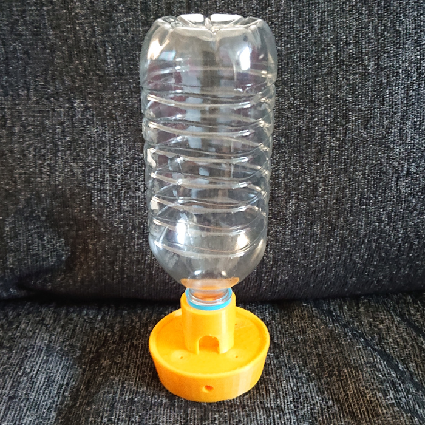

# Bottle Feeder

A bird feeder reusing an old 1 litre cordial bottle as the hopper to hold the seed.  Also requires two 6mm diameter dowels/thin canes to provide the perches.

Designed in FreeCAD to be 3D printed.
